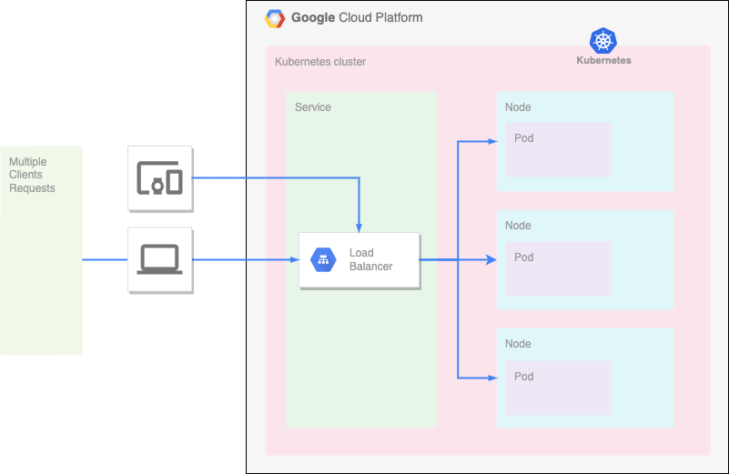

# Deploying a Django App to Google Kubernetes Engine (GKE)

This README provides an overview of the steps involved in deploying a Django app to a Google Kubernetes Engine (GKE) cluster using Google Cloud Build for Continuous Integration/Continuous Deployment (CI/CD).

## Prerequisites
Before you begin, ensure you have the following prerequisites in place:

- A Django web application that you want to deploy.
- A Google Cloud Platform (GCP) project with billing enabled.
- Google Cloud SDK (gcloud) installed and configured with the necessary permissions.
- Google Cloud Build service enabled for your project.

## Steps
### 1. Build a Docker Container with Django
   -  Dockerize your Django application by creating a Dockerfile in your project directory. Ensure it contains instructions to build your app.
   - Build the Docker image using the docker build command, tagging it appropriately. For example:

### 2. Push the Docker Image to Google Container Registry
   - Authenticate to Google Cloud using gcloud auth login if you haven't already.
   - Push the Docker image to Google Container Registry (GCR).

### 3. Deploy a Kubernetes Cluster Using Terraform
   - Define your Kubernetes cluster configuration in Terraform, specifying the desired number of nodes, machine types, and other settings.
   - Run terraform init and terraform apply to create the GKE cluster.

### 4. Connect to the Kubernetes Cluster
   - Use gcloud container clusters get-credentials to configure kubectl to use the newly created GKE cluster.

### 5. Deploy Django Container to GKE with Google Cloud Build
   - Configure a Google Cloud Build trigger to automatically build and push your Django app container image to GCR whenever code changes are detected in your repository.
   - Create a Kubernetes Deployment YAML file (e.g., django-app-deployment.yaml) that defines the deployment of your Django app container.
   - Deploy the Django app container using kubectl as part of your Cloud Build pipeline

### 6. Deploy Django Service to GKE (Load Balancer)
   - Create a Kubernetes Service YAML file (e.g., django-app-service.yaml) that defines a LoadBalancer service for your Django app.
   - Deploy the Django service using kubectl as part of your Cloud Build pipeline. 

## Here is the solution diagram.

